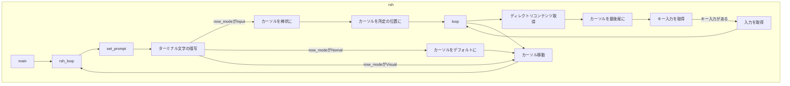

## TODO

- [ ] 実行ファイルの予測変換
- [ ] 変数参照
- [ ] If
- [ ] While

```mermaid
flowchart TD

subgraph rsh
main-->rsh_loop-->set_prompt-->ターミナル文字の描写

ターミナル文字の描写-->|now_modeがInput|カーソルを棒状に-->カーソルを所定の位置に-->
loop-->ディレクトリコンテンツ取得-->カーソルを最後尾に-->キー入力を取得-->|キー入力がある|入力を取得-->loop-->カーソル移動

ターミナル文字の描写-->|now_modeがNomal|カーソルをデフォルトに-->カーソル移動

ターミナル文字の描写-->|now_modeがVisual|カーソル移動
-->rsh_loop

end

```
